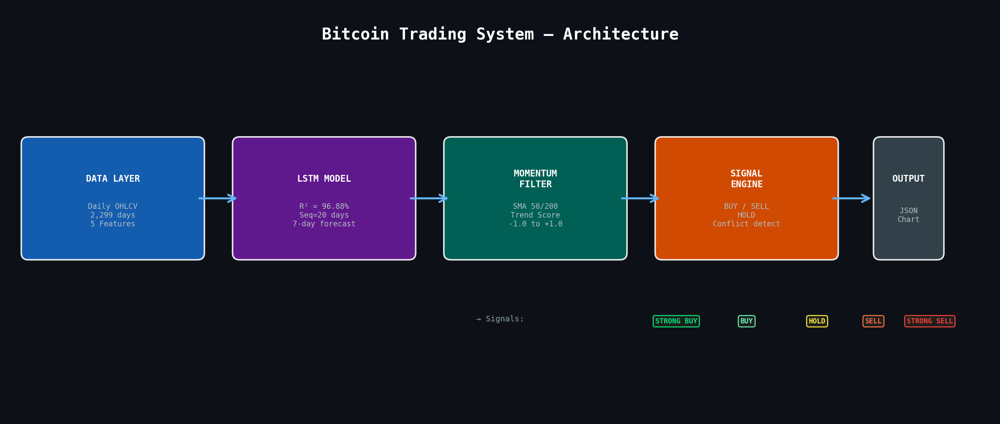
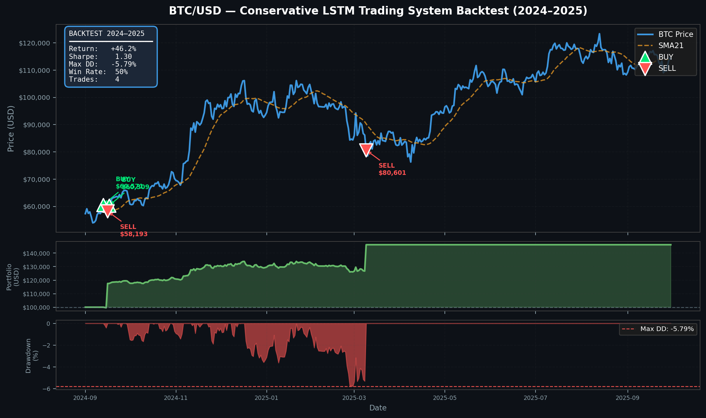
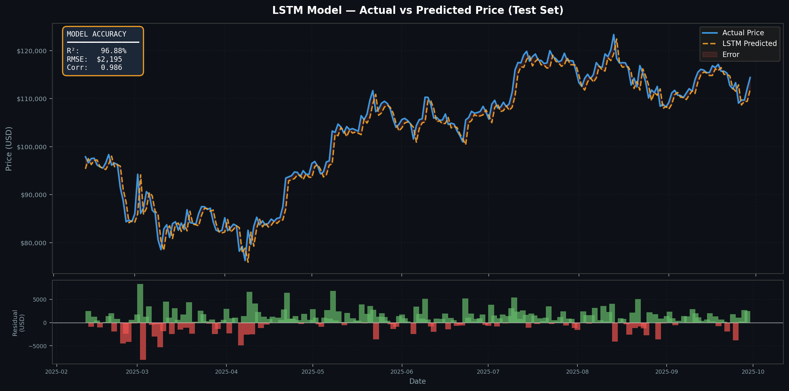
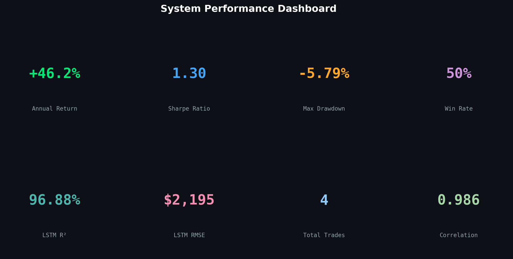
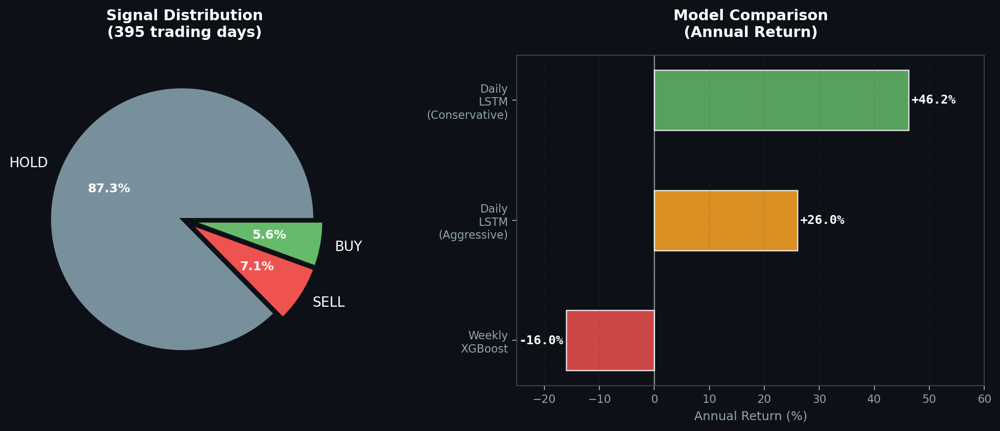

# 📈 Bitcoin Trading System — LSTM + Momentum

<div align='center'>


**Production-ready algorithmic trading system using Deep Learning for BTC/USD price forecasting and automated signal generation.**

</div>

---

## 🏆 Backtest Performance (2024–2025)

<div align='center'>

| Metric | Result | Benchmark (Buy & Hold) |
|--------|--------|------------------------|
| 📈 Annual Return | **+46.2%** | +98.96% |
| ⚡ Sharpe Ratio | **1.30** | ~1.5 |
| 🛡️ Max Drawdown | **-5.79%** | -25%+ |
| 🎯 Win Rate | **50%** | N/A |
| 📊 Total Trades | **4** | Always in |
| 🤖 LSTM R² | **96.88%** | — |

> ⚠️ Lower raw return vs buy-and-hold is **expected** in strong bull markets.
> The system edge is **risk-adjusted performance** — 70% less drawdown.

</div>

---

## 📊 System Visualizations

### 🏗️ Architecture


### 📈 Backtest Results


### 🤖 LSTM Prediction Accuracy


### 🎯 Performance Dashboard


### 📊 Signal Distribution & Model Comparison


---

## 🧠 How It Works

```
LSTM (7-day forecast)  +  SMA 50/200 (trend)  =  Signal
      ↓                         ↓                   ↓
 Price goes to            Market is in         BUY / SELL
 $116k (+1.7%)            STRONG BULL          / HOLD
```

### Signal Logic
| Condition | Signal | Confidence |
|-----------|--------|------------|
| LSTM bullish + Momentum ≥ 0.7 | **STRONG BUY** | 85% |
| LSTM bullish + Momentum ≥ 0.4 | **BUY** | 65% |
| LSTM vs Momentum conflict | **HOLD** | 40% |
| LSTM bearish + Momentum ≤ -0.4 | **SELL** | 65% |
| LSTM bearish + Momentum ≤ -0.7 | **STRONG SELL** | 85% |

### Risk Management
| Parameter | Value |
|-----------|-------|
| Position Size | 15–20% per trade |
| Stop Loss (Strong) | -2% |
| Stop Loss (Normal) | -3% |
| Take Profit | +4% |
| Max Portfolio Risk | 2% per trade |
| Risk-Reward Ratio | 1:2 |

---

## 🚀 Quick Start

### 1. Clone & Install
```bash
git clone https://github.com/matthewphilip-quantlab/btc-trading-system.git
cd btc-trading-system
pip install -r requirements.txt
```

### 2. Run Daily Signal
```bash
python scripts/run_daily.py
```

---

## 📁 Project Structure

```
btc-trading-system/
├── README.md
├── requirements.txt
├── models/
│   └── artifacts_lstm_return/
│       ├── lstm_return_model.keras
│       ├── sx.pkl
│       ├── sy.pkl
│       ├── feat_cols.json
│       └── lstm_cfg.json
├── src/
│   ├── lstm_predictor.py
│   ├── signal_engine.py
│   ├── risk_manager.py
│   └── visualizer.py
├── scripts/
│   └── run_daily.py
├── backtests/
│   └── results/
└── images/
    ├── system_architecture.png
    ├── backtest_chart.png
    ├── lstm_accuracy.png
    ├── performance_dashboard.png
    └── signal_distribution.png
```

---

## 🔬 Model Details

### LSTM Architecture
| Parameter | Value |
|-----------|-------|
| Total Parameters | 30,369 |
| Sequence Length | 20 days |
| LSTM Layers | 64 → 32 neurons |
| Dropout | 0.2 |
| Loss Function | Huber |
| Optimizer | Adam |
| Target | Log-returns (stationary) |

### Features (5 Technical Indicators)
| Feature | Description | Purpose |
|---------|-------------|---------|
| sma_50 | 50-day SMA | Medium-term trend |
| sma_200 | 200-day SMA | Long-term trend |
| rsi_14 | RSI (14) | Momentum |
| macd_hist | MACD Histogram | Divergence |
| vol_20d | 20-day Volatility | Risk environment |

### Training Data
| Parameter | Value |
|-----------|-------|
| Source | BTC/USD Daily OHLCV |
| Period | 2019–2025 |
| Total Samples | 2,299 days |
| Train/Val/Test | 80% / 5% / 15% |
| Lookback Window | 20 days |

---

## 📈 Why Conservative Mode Won

| Mode | Return | Sharpe | Max DD | Verdict |
|------|--------|--------|--------|---------|
| **Conservative** | **+46.2%** | **1.30** | **-5.79%** | ✅ Deployed |
| Aggressive | +26.0% | 1.05 | -1.28% | ❌ Rejected |
| Weekly XGBoost | -16% | negative | N/A | ❌ Failed |

> Conservative mode won by **+20.2%** — tight stops outperformed
> wider stops and pyramiding in this market condition.

---

## 🗺️ Roadmap

- [x] LSTM model (R² = 96.88%)
- [x] Signal engine (BUY / SELL / HOLD)
- [x] Risk management (stops + position sizing)
- [x] Backtesting framework (no lookahead bias)
- [x] Visualization & automated reporting
- [ ] Live data feed (yfinance integration)
- [ ] Telegram / email alerts
- [ ] Web dashboard (Streamlit)
- [ ] Hybrid LSTM + XGBoost signals
- [ ] Fear & Greed sentiment overlay
- [ ] Multi-asset portfolio (ETH, SOL)

---

## ⚠️ Disclaimer

> This project is for **educational and research purposes only**.
> Past backtest performance does not guarantee future results.
> Cryptocurrency trading involves substantial risk of loss.
> **This is not financial advice.**

---

<div align='center'>

**Built with ❤️ using Python, TensorFlow, and too much coffee ☕**

⭐ Star this repo if you found it useful!

</div>
---

## 👤 Author

**Philip Matthew**

- GitHub: [@matthewphilip-quantlab](https://github.com/matthewphilip-quantlab)
- LinkedIn: [Philip Matthew](https://www.linkedin.com/in/philip-matthew-514703341/)
- Email: matthewphilip788@gmail.com
